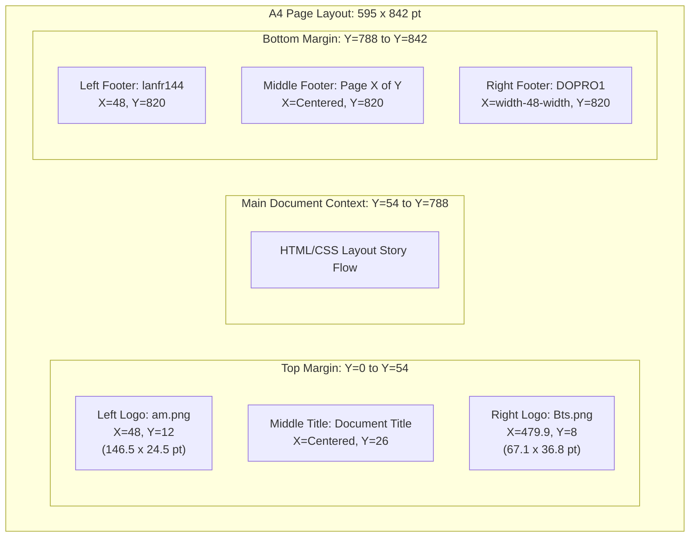

The current version is #ident "@(#)$Format:LocalFoodAI_lanfr144:Header_Footer_Antigravity.md:%an:%ae:%ad:%cn:%ce:%cd:%H:%D:%N$"

# PDF Header and Footer Generation Guidelines (Antigravity Standard)

This document provides guidelines on how to programmatically inject institutional headers and footers into compiled PDF documents using Python and PyMuPDF (`fitz`). 

## 1. Concept

Instead of relying on fragile HTML/CSS page rendering contexts that vary across layout engines, the Antigravity approach compiles standard Markdown to a clean, margin-compliant intermediate PDF. We then perform a post-processing pass using PyMuPDF to draw vector logos, document title headers, and footer blocks on every page at absolute coordinates.

## 2. Layout Structure

The layout bounds on a standard A4 page (595 x 842 points) are mapped as follows:



## 3. High-Quality Scaled Drawing

To ensure maximum visual fidelity when zoomed, follow these steps:
1. **Load PNGs as Pixmaps**: Read the image size using PyMuPDF `fitz.Pixmap`.
2. **Compute 10% Bounds**: Scale the pixel width and height to 10% for layout dimensions in points.
3. **Draw Bounds**: Insert the image using `page.insert_image(rect, filename)`. The full resolution is embedded in the PDF, keeping quality high when zoomed.
4. **Optimized Saving**: Always save the PDF with deflate compression, garbage collection, and linearization:
   ```python
   doc.save(pdf_file, clean=True, garbage=3, deflate=True)
   ```
