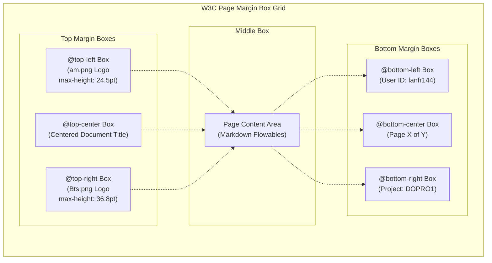

The current version is #ident "@(#)$Format:LocalFoodAI_lanfr144:Header_Footer_Gemini.md:%an:%ae:%ad:%cn:%ce:%cd:%H:%D:%N$"

# PDF Header and Footer Generation Guidelines (Gemini Standard)

This document describes how to implement standard headers and footers using the Gemini declarative styling approach. This model uses CSS Paged Media specifications to design page layouts directly during HTML-to-PDF compilation.

## 1. Concept

Unlike programmatic post-processing, the Gemini approach relies on standard CSS Page Margin Boxes defined within the `@page` context. The layout engine allocates page margin spaces and positions the logos, titles, and page numbers based on CSS property rules.

## 2. Page Margin Box Layout Model

The CSS Paged Media margin boxes are structured as follows around the main page area:



## 3. CSS Declaration Example

To implement the Gemini standard paged layout, include the following CSS rules inside the stylesheet used by the PDF engine:

```css
@page {
    size: A4;
    margin: 60pt 48pt 54pt 48pt; /* Set top margin to 60pt to prevent collisions */
    
    @top-left {
        content: url("am.png");
        image-resolution: 300dpi;
        vertical-align: middle;
        z-index: -1; /* Place in background */
    }
    
    @top-center {
        content: "Document Title";
        font-family: 'Helvetica', sans-serif;
        font-size: 8pt;
        color: #808080;
        vertical-align: middle;
        text-align: center; /* Center between left/right margin boxes */
    }
    
    @top-right {
        content: url("Bts.png");
        image-resolution: 300dpi;
        vertical-align: middle;
    }
    
    @bottom-left {
        content: "lanfr144";
        font-family: 'Helvetica', sans-serif;
        font-size: 8pt;
        color: #808080;
    }
    
    @bottom-center {
        content: "Page " counter(page) " of " counter(pages);
        font-family: 'Helvetica', sans-serif;
        font-size: 8pt;
        color: #808080;
    }
    
    @bottom-right {
        content: "DOPRO1";
        font-family: 'Helvetica', sans-serif;
        font-size: 8pt;
        color: #808080;
    }
}
```
