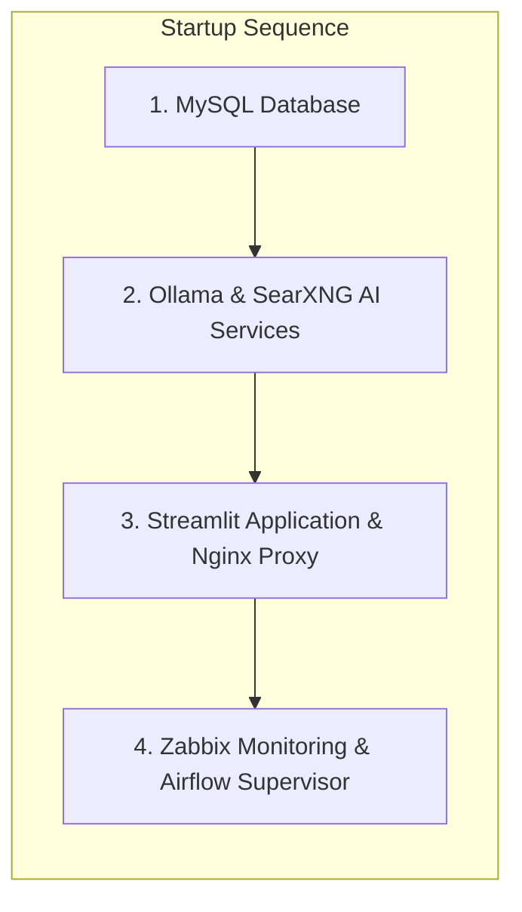

# $Id: 1701828b122e0c319e59134ca6511a42ecad9297 Lange François lanfr144@school.lu 2026/06/11 08:26:59 Lange François lanfr144@school.lu 2026/06/11 08:26:59   [TG-131] Purge database passwords from tracked files and format application versioning [PreRelease-1.0-26-g1701828] $
# Infrastructure Stop & Start Operational Procedures

This runbook outlines the exact sequence and commands to start, stop, and verify each microservice in the Local Food AI environment.

---

## 1. Sequence Priority Rules
Due to database socket requirements and network bindings, services **must** be started and stopped in the following order:



---

## 2. Startup Procedures

### Step 2.1: Start the Core MySQL Database
Verify that the database service is up and listening on port 3307:
```bash
docker compose up -d mysql
# Verify database logs
docker compose logs -f mysql
```

### Step 2.2: Start AI Engine & SearXNG Search
Deploy the AI components:
```bash
docker compose up -d ollama searxng
# Check that Ollama responds
curl http://localhost:11434/api/tags
```

### Step 2.3: Start Streamlit App and Nginx Gateway
Bring up the frontend web interface and reverse proxy:
```bash
docker compose up -d app nginx
# Verify Web Interface status
curl -I http://localhost
```

### Step 2.4: Start Zabbix Monitoring Suite
Deploy the monitoring server and agents:
```bash
docker compose up -d zabbix-server zabbix-web zabbix-agent
# Check dashboard availability
curl -I http://localhost:8081
```

---

## 3. Shutdown Procedures

To perform system maintenance or schema migration, stop services in reverse order to prevent lockups:

```bash
# 1. Stop Monitoring Components
docker compose stop zabbix-agent zabbix-web zabbix-server

# 2. Stop Web Frontend and Proxy Gateway
docker compose stop nginx app

# 3. Stop NLP and Search Services
docker compose stop searxng ollama

# 4. Stop Database Container gracefully
docker compose stop mysql
```

---

## 4. Status Verification Commands
Use these commands to verify container state and port bindings:
```bash
# List all running containers in the stack
docker compose ps

# Inspect raw container logs for error spikes
docker compose logs --tail=100

# Verify TCP socket listener binds
netstat -tulpn | grep -E "80|3307|8081|11434"
```
