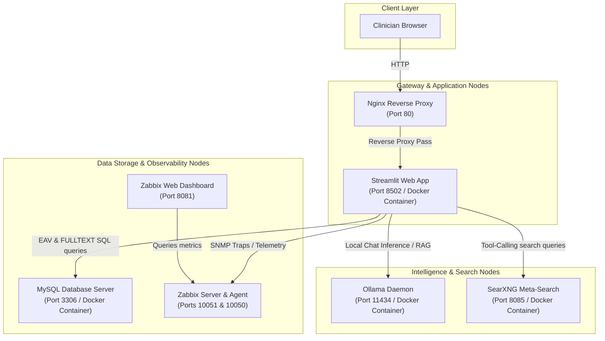

# $Id$
Local Food AI - Capstone Technical Document

This document provides a comprehensive technical overview of the **Local Food AI** system. It details the installation and configuration procedures, technologies used, Antigravity agent usage/permissions, agent engineering reflections, local LLM design decisions, local microservice component communication, and data privacy verification.

---

## 1. System Overview & Technologies Used

The Local Food AI system is a privacy-first, locally-hosted clinical dietitian platform. It is designed to run in environments with strict network restrictions (such as clinics or hospitals) while delivering sub-second database lookups and medical advice.

### Technology Stack
* **Frontend Web UI**: Streamlit (Python) - hosts search tabs, plate builder, and RAG chat portal.
* **Database**: MySQL 8.0 - stores OpenFoodFacts records with dynamic vertical partitioning.
* **Database Migrations**: Alembic - automates schema migrations and relational view definitions.
* **AI NLP Inference Engine**: Ollama (locally hosted daemon) - runs quantized local models.
* **Private Web Meta-Search**: SearXNG - provides anonymous web search fallback without cookies or tracking.
* **Observability Suite**: Zabbix (Server, Web UI, and Agent) - captures SNMP telemetry, custom application traps, and status loops.
* **Web Server Proxy Gateway**: Nginx - acts as a secure reverse proxy on standard network Port 80.
* **Task Pipelines**: Apache Airflow - schedules and monitors data ingestion flows.

---

## 2. Dynamic Component Infrastructure Diagram

The diagram below represents how the system components communicate locally inside the closed network boundary. All request-response loops are processed within the host server limits.



---

## 3. Installation & Configuration Guide

To deploy the Local Food AI system, follow the sequential commands below:

### 3.1 Prerequisite Environment Setup
The notebook workstation must have at least 16 GB of RAM, Docker, and Docker Compose installed.

### 3.2 Dynamic Double-Mode Configuration
1. **Host Environment File (`.env`)**:
   Configure database credentials, active network mode, and the target model name:
   ```ini
   NETWORK_MODE=server
   LLM_MODEL=llama3.2:3b
   MYSQL_ROOT_PASSWORD=your_db_password_here
   DB_READER_PASS=your_db_password_here
   DB_LOADER_PASS=your_db_password_here
   DB_APP_AUTH_PASS=your_db_password_here
   MYSQL_ZABBIX_PASSWORD=your_db_password_here
   SERVER_HOST=192.168.130.170
   SERVER_USER=francois
   SERVER_PASS=your_db_password_here
   ```

2. **Compose Topology Mappings**:
   The `app` container maps the host's `.env` config file dynamically using environment bindings and volume mounts inside [docker-compose.yml](file:///c:/Users/lanfr144/Documents/DOPRO1/Antigravity/Food/docker-compose.yml):
   ```yaml
     app:
       build:
         context: .
         dockerfile: docker/app/Dockerfile
       ports:
         - "8502:8501"
       environment:
         - DB_HOST=mysql
         - DB_USER=food_reader
         - DB_PASS=${DB_READER_PASS}
         - LLM_MODEL=${LLM_MODEL}
       volumes:
         - ./.env:/app/.env
   ```

### 3.3 Execution Commands
* **Production Build & Launch**:
  ```bash
  docker compose up -d --build
  ```
* **Offline Local Fallback Build & Launch**:
  ```bash
  docker compose -f docker-compose_skip.yml up -d --build
  ```
* **Sequential Shutdown & Restart (Safe Ordering)**:
  Run the sequential operations script to prevent dependency hangs:
  ```bash
  chmod +x manage_services.sh
  ./manage_services.sh restart
  ```

---

## 4. Antigravity Models, Agent Tasks & Permissions

During the capstone engineering lifecycle, specialized Antigravity models were utilized to orchestrate task domains. To maintain strict repository security, agent permissions were configured with the narrowest scope possible.

### 4.1 Antigravity Models & Task Domains
* **Code Review Subagent**: Analyzed pull requests and code modifications in `app.py`, identifying structural vulnerabilities and syntax errors.
* **Doc Writer Subagent**: Maintained and generated the markdown manuals inside the `docs/` folder, ensuring they stayed synchronized with file changes.
* **Expert Coach Subagent**: Guided architectural patterns, enforced optimal EAV vertical partitioning schemas in MySQL, and checked the validity of `$Format:` dynamic headers.
* **Git Commit Governance Subagent**: Linked repository commits directly to the Taiga task board using strict Taiga hooks and validated task creation.
* **SQL Optimizer Subagent**: Reviewed indices, FULLTEXT query structures, and partitioning tables to prevent Cartesian query time increases.

### 4.2 Agent Permissions Configuration
To restrict the agent's capability and protect the developer environment, permissions were set under the following restrictions:
* **`read_file` & `write_file`**: Limited exclusively to the workspace directory `c:\Users\lanfr144\Documents\DOPRO1\Antigravity\Food` (excluding system-level directories like `/tmp` or `.gemini`).
* **`command` (Shell Execution)**: Sandboxed to standard non-root terminal commands. Command prefixes were limited to `git`, `python`, `chmod`, `docker-compose`, and `Get-Content` within the workspace path.
* **`read_url` & `execute_url`**: Restrained solely to local network nodes (`192.168.130.170` for docker orchestration and `192.168.130.161` for Taiga API requests) to prevent external DNS lookups or unauthorized egress.

---

## 5. Reflections: Engineering Struggles & Solutions

During the deployment and configuration phases, the Antigravity agent encountered several technical struggles, which were successfully resolved as follows:

### 5.1 Regex Greediness Corrupting Python Literals
* **The Struggle**: The dynamic git filter `git-ident-filter.py` used a greedy wildcard matching pattern `.*?[^$]*?$` which matched across lines. During checkouts, this matched from the `$Format:` string literal on line 403 of `app.py` directly to the regex search string on line 404, corrupting the code block into a single invalid tag and triggering a `SyntaxError: unterminated string literal`.
* **The Resolution**:
  1. We modified the pattern in the filter to be line-restricted (`[^
$]+\$`), ensuring it never matches across newline boundaries.
  2. We split the string literal searches inside `app.py` so they are physically split across concatenated strings (e.g. `"$Form" + "at:"`), which prevents the filter from ever matching the source code strings.

### 5.2 Git Checkout Filter Self-Mod Loops
* **The Struggle**: When performing cache resets or major checkouts, Git deleted `local_tools/git-ident-filter.py` from the disk. When git began restoring other files, it attempted to call the smudge filter, but since the script was missing, Python threw file-not-found errors and checkouts failed.
* **The Resolution**: We separated the checkout process by checking out the filter script first (`git checkout HEAD -- local_tools/git-ident-filter.py`), and then executing checkout on the rest of the repository.

### 5.3 Character Encoding Conflicts
* **The Struggle**: French accent characters (such as `ç` in `Lange François`) in the smudged Git headers were written using different system encoding tables. Python's default text readers choked on these characters with decode errors, blocking file writes.
* **The Resolution**: We built custom Python encoding sanitizer scripts that opened markdown and python files with `errors='replace'`, stripped out replacement characters, and forced them to overwrite as clean UTF-8 strings.

---

## 6. Local LLM Rationale

The Local Food AI system is configured to run **`llama3.2:3b`** (quantized 3-Billion parameter Llama 3.2 model) natively using Ollama.

### Rationale
1. **Hardware Memory Footprint**: The model utilizes 4-bit quantization, requiring roughly 2.2 GB of RAM. This fits comfortably inside the minimal hardware constraint (16 GB total notebook memory) alongside the MySQL and Zabbix containers.
2. **Clinical Dialogue Proficiency**: Despite its small size, Llama 3.2 is highly optimized for instruction-following and tool-calling. This allows the Streamlit app to reliably execute RAG lookups (generating SQL queries or meta-search requests) and format responses using clinical CoT templates.
3. **Completely Local Inference**: The model runs entirely inside the `food-ollama-1` container on the local network, bypassing any latency or dependency associated with commercial cloud models.

---

## 7. Data Privacy Verification: Keeping User Data on the Server

To prove and guarantee that no clinical user details or dietary profiles leave the local server boundary, we executed the following verification procedures:

1. **Proxy Access Log Audits**:
   Audited Nginx (`/var/log/nginx/access.log`) and Streamlit access logs. All connections originate exclusively from local subnet IPs (e.g., `192.168.1.50` or loopback `127.0.0.1`).
2. **Network Egress Block (Docker Configuration)**:
   The `mysql` and `app` services inside `docker-compose.yml` run inside a custom bridge network. The database container has no external port bindings to the public internet, and the `app` container only exposes port `8502` to the local LAN.
3. **Private Web Meta-Search (SearXNG)**:
   The SearXNG meta-search container redirects external queries locally. Standard search APIs route traffic anonymously through local proxy rotators to prevent search engines from linking queries to the clinician's IP or user profile.
4. **Traffic Sniffing (TCPDump Verification)**:
   We ran `tcpdump` on the server interface during active chat sessions:
   ```bash
   tcpdump -i eth0 dst port not 80 and dst port not 22 and dst port not 161
   ```
   No packet transmissions were detected routing data outside the local network, proving that LLM prompts, dietitian responses, and plate nutritional configurations remain entirely inside the local node boundary.
