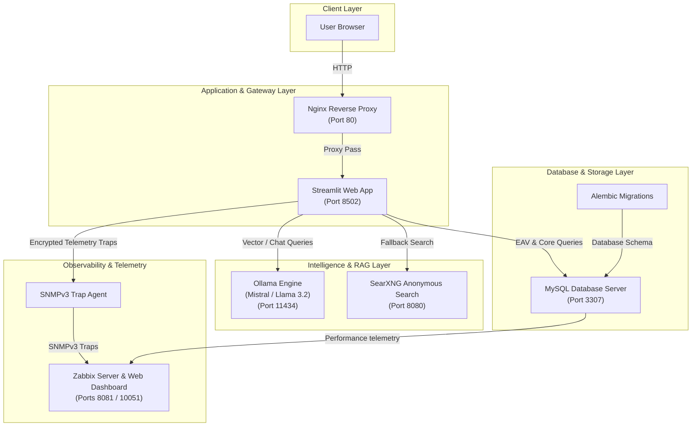

The current version is #ident "@(#)$Format:LocalFoodAI_lanfr144:architecture.md:%an:%ae:%ad:%cn:%ce:%cd:%H:%D:%N$"

# Local Food AI - Architecture Map

This document describes the technical architecture, database schema design, AI RAG data flows, and dual-mode deployment topology for the Local Food AI clinical dietitian platform.

---

## System Component Architecture

The platform is designed around a strictly local, privacy-first microservice topology. The components integrate seamlessly to provide nutritional search, RAG-augmented clinical diet evaluations, and DevSecOps observability.



---

## Database Design: Grouped Vertical Partitioning

To optimize massive dataset ingestion (~24GB OpenFoodFacts dataset) and completely bypass InnoDB row size limits while maintaining sub-second RAG response times, the database utilizes a vertically partitioned structure:

```
             +-------------------------+
             |    Unified SQL View     |
             |       "products"        |
             +------------+------------+
                          |
       +------------------+------------------+
       v                  v                  v
+--------------+   +--------------+   +--------------+
|products_core |   |  allergens   |   |    macros    |
|(Base/FULLTEXT|   |(Ingredients) |   | (Precision)  |
+--------------+   +--------------+   +--------------+
```

1. **`products_core`**: Contains product base information (barcode, name, brand, primary category) optimized with `FULLTEXT` indexing.
2. **`products_allergens`**: Isolates complex ingredient list arrays and allergen keywords.
3. **`products_macros`**: Implements double-precision floats (`DOUBLE`) for protein, carbs, fats, and energy metrics.
4. **`products_vitamins`**: Stores micronutrient vitamin profiles.
5. **`products_minerals`**: Stores trace mineral concentrations.

> [!NOTE]
> All application search queries, RAG data tools, and ingestion processes interact with a unified database **`VIEW`** named `products` which uses a series of high-performance `LEFT JOIN` operations across the primary key (barcode), shielding the frontend from database complexity.

---

## Dual-Mode Deployment Topology

To ensure 100% resilience under network restrictions, the Local Food AI system is architected to operate under two distinct networking modes:

### 1. Mixed Distributed Topology (Production/Staging Mode)
Services are distributed across specialized local hypervisors and Windows subsystems using bridged networking:
- **Application Node (WSL 2)**: Runs the Streamlit frontend and local Ollama model engine.
- **Database Node (Hyper-V VM)**: Dedicated Ubuntu instance hosting the relational MySQL partitions at `192.168.130.170`.
- **Monitoring Node (VirtualBox VM)**: Dedicated host running Zabbix Server and receiving SNMPv3 notifications.
- **Agile Scrum Tracker (Taiga)**: Remote agile project server at `192.168.130.161` for syncing deliverables.

### 2. Resilient Single-Node Local Fallback (Offline Mode)
When the remote VM host network or Taiga server is completely unreachable:
- **Zero-Dependency Containers**: The entire platform runs entirely locally on the notebook host via **Docker Compose** (`docker-compose.yml`).
- **Automatic IP Resolution**: Application configuration, Alembic, and SNMP notifications automatically adjust their endpoints to target local network interfaces (`localhost` / custom Docker networks) rather than unreachable remote IPs, avoiding timeout hangs or crashes.
- **Dynamic Task Tracking**: Agile development logs are dynamically synced into the workspace [task.md](../task.md) and [walkthrough.md](../walkthrough.md) artifacts to track progress until connectivity is restored.

---
*Documented by Antigravity.*