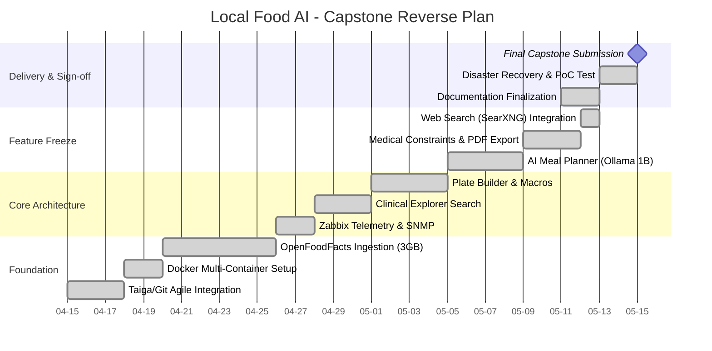

# Local Food AI: Retro Planning

*Document compiled in accordance with BTS-AI DOPRO Guidelines on Backward/Reverse Planning.*

## 1. Concept of Retro Planning
As defined in the course material, Retro Planning (Backward Planning) is constructed in reverse chronological order from a fixed deadline. This ensures that the D-Day (Capstone Submission) is immutably fixed, and all prior sprints and tasks are mathematically bound to ensure the feasibility of the project. 

Our delivery date is set for **May 15th, 2026**.

## 2. Reverse Chronological Timeline (Gantt Structure)

## 3. Resource & Buffer Analysis
- **Milestone Buffers**: By utilizing a reverse plan, we identified that the massive 3GB OpenFoodFacts dataset required a 6-day window for background ingestion without blocking the frontend development. 
- **Leeway Analysis**: The final 2 days (May 13 - 15) are strictly reserved for Disaster Recovery (DR) drills and Multi-VM Proof of Concept (PoC) validation, ensuring the presentation runs flawlessly regardless of infrastructure hiccups.
